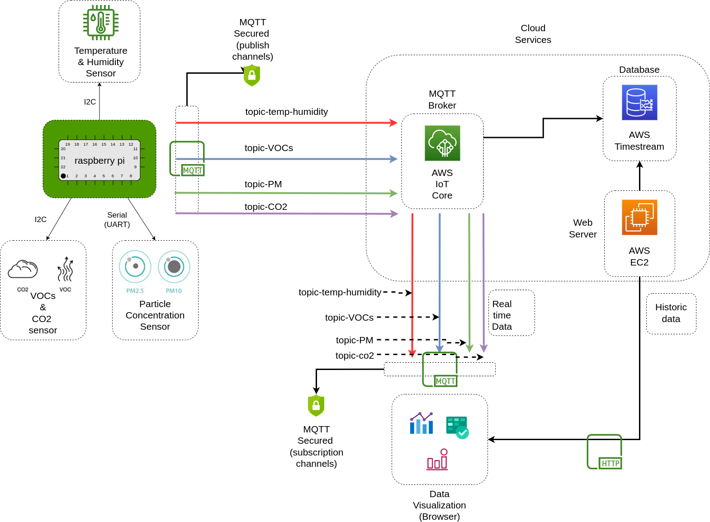
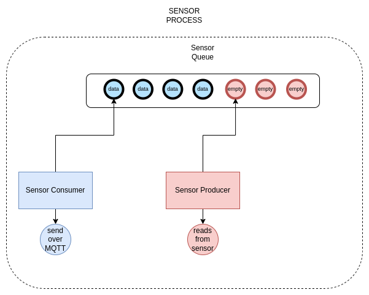

# Indoor air quality monitoring system based on a Rasberry Pi board and AWS IoT Core

The raspberry pi reads the data from the sensors (PM2.5, PM10, co2, VOCs, temp, and humidity) and sends the data over the internet using the MQTT protocol.
The MQTT broker (AWS IoT Core) manages the MQTT connections and security so other clients can connect to the same
network/topic to received the published data.
The data is also stored in a database (AWS Timestream) to be fetched later.

The client ui (Angular application) subscribes to the sensor topics to graph the realtime data from the sensors and
it also communicates with a REST API to get the historic data from the database.




## Sensor process

Each sensor has associated a queue, a producer and a consumer. The producer is scheduled to read the sensor data every X seconds and puts the sensor reading in the sensor queue with a timestamp. On the other hand, the consumer is also scheduled to read the sensor queue and sends the data over MQTT using the following JSON format

```
{
    'stationId': '<station-id>',
    'value': 10,
    'timestamp': "2022-01-31T14:00:00Z"
}
```

This pattern allow us to avoid data loss if the internet connection is unstable since a failure in sending the data will result 
in the consumer putting the data back to queue so it can be sent later.
We could get memory errors if the internet connection is lost for long enough, so it's important to set a max capacity in the queue.
In this case, we are using a circular queue to avoid memory errors (If the queue is full, we will make room for new data by deleting older data).

The sensor queue, scheduled producer, and scheduled consumer is what we call a ***sensor process***



## Domain concepts

We tried out best to write the code using a [Domain Driven Design](https://martinfowler.com/bliki/DomainDrivenDesign.html/) approach.
This makes the code cleaner and also allow us to change implementations more easily.

the source code for the iqa-station is split into 2 categories: domain and infrastructure

### Domain

The domain code contains the concepts explained in the [Sensor process section](#sensor-process). We have a queue, a sensor, etc. But we don't care about the actual implementation. This is, we don't care if it is a temperature sensor or if the sensor is an analog or digital sensor. In this layer, we only have a *thing* called a sensor from where we can read data from and we have a *queue* in which we can put the data.

This layer consists mostly of interfaces. Here we only care about the high level behavior and not about the *how*. For example: we're reading the data from a sensor but we don't care about how we are doing it. Are we reading the sensor over I2C or SPI? is it an analog sensor? we don't care about that here. As far a we are concerned, the sensor is just a black box and we don't want to pollute our domain with infrastructure specifics (like I2C, SPI, UART, AD/C libraries) 

### Infrastructure

The domain concept sounds great. We're reading from a *thing* called sensor, we're putting the sensor data into a *queue*, and then
the data is sent by a *thing* called sender. But at some point we should get our hands dirty with the actual implementations. This is where the infrastructure layer comes into place. Here, we define the actual implementations that are being passed to the domain layer.
If we're using a sensor that interfaces over I2C, then we write the actual code using the appropiate libraries and so on. If in a future we decide to change to another sensor which interfaces over SPI, then we only change the implementation without changing our domain code.
This also makes it easier to unit test. For example, you can create a fake implementation that's only reading random generated values rather than using an actual sensor. This also allow us to make our code portable across different platforms. You only need to bootstrap the right infrastructure depending on the platform you targeting to (raspberry-pi, raspberry-pi pico, or anything that can execute python code).
As a good example of the usage of this pattern/architecture, we're providing two different infrastructure implementations: one based on a raspberry pi (with actual I2C and UART sensors connected to it) and one based on a generic linux pc (with a bunch of fake/software sensors for testing purposes)


### Running the station code

This code is meant to be executed in a [python virtual environment](https://docs.python.org/3/library/venv.html#module-venv) 

move to the directory **iaq-station** and execute 

```
pip install -r requirements.txt
source bin/activate
python3 main.py
```


